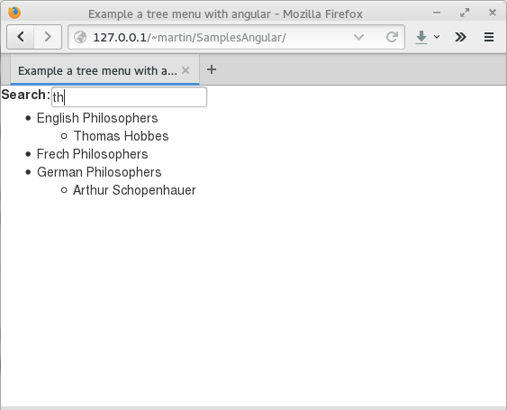

# Entiendo Angular: Un primer acercamiento
		

<b>AngularJS</b> es un framework open source escrito en JavaScript que sirve para implantar el patrón MVC del lado del cliente, lo que permite que puedan contruirse aplicaciones Web del tipo <b>AJAX</b>, por su poder expresivo se utiliza en la mayoría de proyectos <b>SPA</b> (Single Page Application).

    <h2>Qué es SPA?</h2>
    
<b>SPA</b> (Single page Application) es una aplicación en la cual se tiene una página principal como contenedor y varias vistas contenidas dentro este contenedor que pueden refrescarse independientemente de la página principal evitando así hacer una petición de toda la página completa, lo que ayuda a hacer eficiente el ancho de banda sobretodo en aplicaciones móviles.

    

      Las ventajas de Angular son:
      <ul>
        <li>Proporciona la capacidad de crear SPA de una manera clara y mantenible</li>
        <li>Le proporciona una capacidad de data binding al HTML, lo que proporciona una experiencia responsiva al usuario.</li>
        <li>El código hecho con Angular se puede probar mediante pruebas unitarias (Unit Testing)</li>
        <li>Utiliza la inyección de dependencias para la separación de responsabilidades.</li>
        <li>Proporciona componentes reutilizables ya que las vistas son páginas HTML y la lógica de procesamiento se lleva a cabo por los controllers (controladores) escritos en JavaScript.</li>
        <li>Angular es compatible entre la mayoría de las plataformas (Android, IOS) y navegadores.</li>
        <li>Puede combinarse con otras bibliotecas para JavaScript por ejemplo: Kendo UI y Jquery.</li>
      </ul>
    

    
Hay dos conceptos básicos para empezar con Angular, uno es el <b>$scope</b> y el otro es la utilización de <b>directives</b> (directivas), para ejemplificar su uso, mostraré una página que despliega un lista de filósofos de cada país la cual es posible filtrar al escribir el nombre en un control INPUT.

    <h2>¿Qué es el scope?</h2>
    
Una buena separación de aspectos no permite que la lógica de negocio se mezcle con la vista, así que todo el procesamiento se realiza mediante el controlador el cuál es el que enlaza los datos hacia la vista.
Una parte integral para trabajar con angular es el llamado <b>scope</b> que en realidad es un alias para el <i>ViewModel</i> es decir el componente que permite que se comuniquen la vista y el controlador.

    
Aquí el código fuente del archivo <i>MenuAngular.js</i> el cuál contiene el <b>JSON</b> y la declaración del <i>controller</i>.

      

      
      
 
    
Aquí el código fuente de la página HTML:

      <!--------------PRE HTML------------------>
      

      
      
 
      <!--------------PRE HTML------------------>
    <h2>¿Qué son las directives?</h2>
    
Son atributos HTML que llaman funciones pertenecientes al framework para extender de manera dinámica la funcionalidad del elemento HTML al cual pertenecen, esta es la manera básica de crear elementos HTML específicos para la aplicación, encapsular estructuras DOM complejas o manipular las hojas de estilo.

    
A continuación una breve descripción de las directivas que se utilizaron en el ejemplo:

    

      <ul>
        <li><b>ng-app:</b> Esta directiva sirve para incluir e iniciar <b>AngularJS</b> y que se pueda utilizar en un página HTML. Generalmente esta directiva va en la etiqueta BODY o en HTML.
        </li>
        <li><b>ng-controller:</b> Esta directiva indica que controlador se va a utilizar en esa página o vista. Angular nos permite tener múltiples instancias de el mismo controlador en la aplicación, permitiéndonos reutilizar un montón de código.
        </li>
        <li><b>ng-repeat:</b> Con esta directiva se puede enumerar o iterar en una lista de objetos similar a recorrer un de un arreglo con la instrucción <b>foreach</b> de algunos lenguajes de programación. Adicionalmente a esta directiva le agrego la directiva <b>filter:Name</b> la cuál establece el filtro de búsqueda dentro del arreglo, en este caso el filtro es el valor de la variable enlazada con <b>ng-model</b>.
        </li>
        <li><b>ng-model:</b> Esta directiva sirva para enlazar el valor de una variable a un control HTML, generalmente se utiliza con los controles INPUT.
        </li>
      </ul>
    

    
Las siguientes imágenes muestran la página en su ejecución.

    
<b>Fig 1</b> La página HTML en ejecución.
 
    

    
    
 
    
<b>Fig 2</b> Ejemplo de una búsqueda con una coincidencia.
 
    

    
    
 
    
<b>Fig 3</b> Una búsqueda con dos coincidencias.
 
    

    
    

